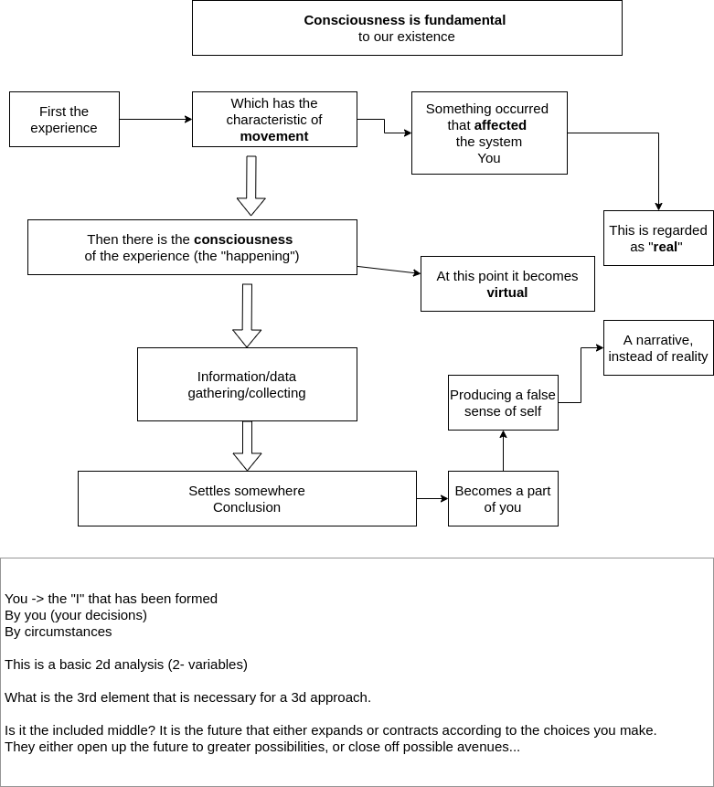

## Consciousness is fundamental

## Message Broker

## Time

> Alan Aferman: _Time, Eternity, and Mystical Experience_.

The mystical path is a path that is focused on mystical encounters that lead to a mystical union, with time as energy.

- Divide time into mundance & sacred time. The Shabbat is the day that we focus on entering sacred time.
- Godhead made out of sacred time
