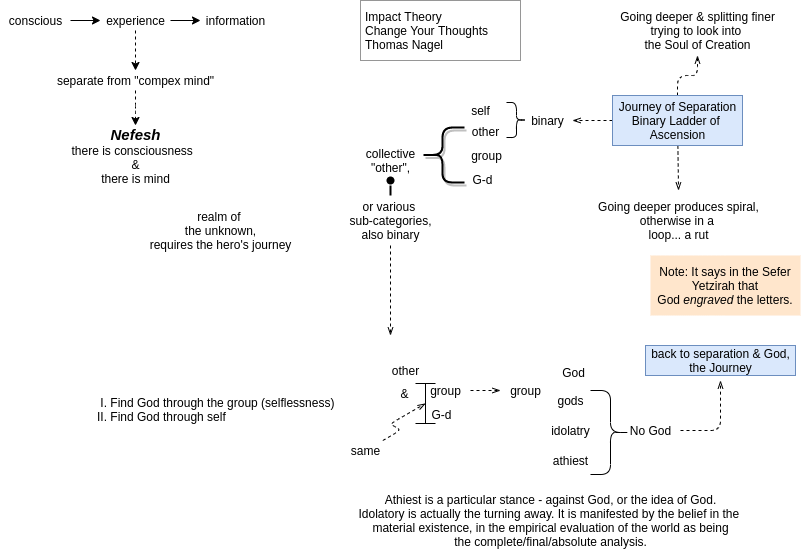

1. [AI](#ai)
2. [Consciousness is fundamental](#consciousness-is-fundamental)
3. [Message Broker](#message-broker)
4. [Time](#time)
5. [Journey of Separation](#journey-of-separation)
6. [Single Letter (Hebrew)](#single-letter-hebrew)

## AI

> **Either our lives are to be determined by human created AI, or by divinely created AI. It is our choice.**

## Consciousness is fundamental

> We awaken to consciousness, but not to [spirit](spirit.html)

## Message Broker

## Time

> Alan Aferman: _Time, Eternity, and Mystical Experience_.

The mystical path is a path that is focused on mystical encounters that lead to a mystical union, with time as energy.

Divide time into mundane & sacred time.

- Mundane Time:
  - Hold time (captive). Keep position. Control change.
- Sacred Time:
  - The Shabbat is the day that we focus on entering sacred time.
  - Actually is "out of time", timeless
  - Godhead made out of sacred time

## Journey of Separation

## Single Letter (Hebrew)

- There are no individual letters in Hebrew, like 'a' or 'I' as in English. This is because it is regarded as a **broken vessel** if it is alone.
- Every object, everything that exists in the Universe is a manifestation of **Divine Desire**.
- Dimensions = **Realities**
  - separated by different relationship with Time.
- We are consciousnessly aware of being **conscious**
  - Speculum
  - self-reflective
