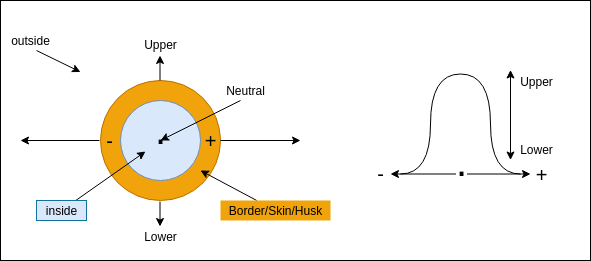

## Three(s)

3 states, 3 responses, 3 reactions: positive, negative & neutral; for, against, not-sure; pro, anti, on the fence; beginning (1), end (infinity), middle (which forms the bulk).

Two ways to deal with the middle: Excluded middle (used mainly in mathematics, and logic, and fascist regimes), or the included middle.

However, the boundaries of the space are defined (expressed) by the extremes (or the limits/boundaries). Thus is it the extremists, what we call the fanatics, or zealots, that pull society this way or that.

## Sovereignty ~ empowerment

> There is no real sovereignty. The only real sovereign is G-d. The only earthly sovereignty we experience, is as power over. What we can seek only in the societal environment, is "empowerment".
